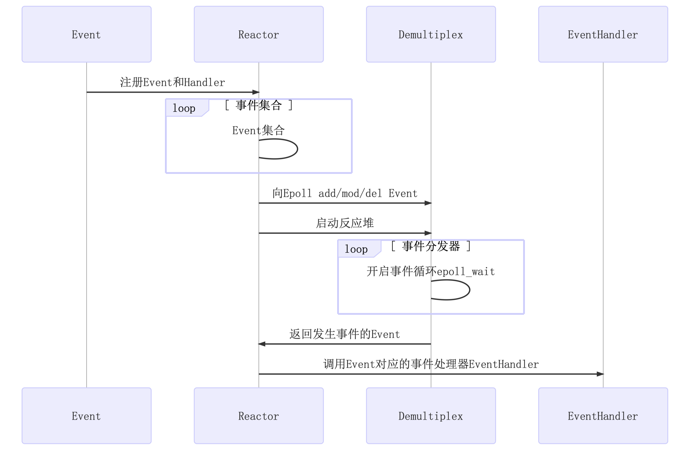

# 网络库实现流程图



## 开发环境

* linux kernel version 4.4.0 (ubuntu 16.04 Server)
* gcc version 5.4.0
* cmake version 3.5.1

项目编译执行`./build.sh`即可，测试用例进入`example/`文件夹，`make`即可生成服务器测试用例

## 功能介绍

头文件生成至目录`/usr/include/netLib/`，`.so`库文件生成至目录`/usr/lib/`。

1. `EventLoop.*`、`Channel.*`、`Poller.*`、`EPollPoller.*`等主要用于事件轮询检测，并实现了事件分发处理的底层实现方法。`EventLoop`负责轮询执行`Poller`，要进行读、写、错误、关闭等事件时需执行哪些回调函数，均绑定至`Channel`中，只需从中调用即可，事件发生后进行相应的回调处理即可
2. `Thread.*`、`EventLoopThread.*`、`EventLoopThreadPool.*`等将线程和`EventLoop`事件轮询绑定在一起，实现真正意义上的`one loop per thread`
3. `TcpServer.*`、`TcpConnection.*`、`Acceptor.*`、`Socket.*`等是`mainloop`对网络连接的响应并轮询分发至各个`subloop`的实现，其中注册大量回调函数
4. `Buffer.*`为`netLib`网络库自行设计的自动扩容的缓冲区，保证数据有序性到达


## 技术亮点

1. `EventLoop`中使用了`eventfd`来调用`wakeup()`，让`mainloop`唤醒`subloop`的`epoll_wait`阻塞
2. 在`EventLoop`中注册回调`cb`至`pendingFunctors_`，并在`doPendingFunctors`中通过`swap()`的方式，快速换出注册的回调，只在`swap()`时加锁，减少代码临界区长度，提升效率。（若不通过`swap()`的方式去处理，而是加锁执行`pendingFunctors`中的回调，然后解锁，会出现什么问题呢？1. 临界区过大，锁降低了服务器响应效率 2. 若执行的回调中执行`queueInLoop`需要抢占锁时，会发生死锁）
3. `Logger`可以设置日志等级，调试代码时可以开启`DEBUG`打印日志；若启动服务器，由于日志会影响服务器性能，可适当关闭`DEBUG`相关日志输出
4. 在`Thread`中通过`C++lambda`表达式以及信号量机制保证线程创建时的有序性，只有当线程获取到了其自己的`tid`后，才算启动线程完毕
5. `TcpConnection`继承自`enable_shared_from_this`，`TcpConnection`对象可以调用`shared_from_this()`方法给其内部回调函数，相当于创建了一个带引用计数的`shared_ptr`，可参考链接 [link](https://blog.csdn.net/gc348342215/article/details/123215888)，同时`netLib`通过`tie()`方式解决了`TcpConnection`对象生命周期先于`Channel`结束的情况
6. `netLib`采用`Reactor`模型和多线程结合的方式，实现了高并发非阻塞网络库


## rpc的实现


库中rpc的实现：netLib_cpp11/example/protorpc


**0.使用网络库的方法：**设置连接回调，并在连接回调中设置消息回调，即给每个到来的连接设置消息回调。
比如RpcServer中，RpcServer::onConnection()设置为TcpServer的连接回调，连接到来时，都会设置RpcChannel::onMessage()作为消息回调。


**1.RpcServer：**
- 成员变量TcpServer对象用于向外提供网络服务。
- registerService()：将自定义的Service放入services_中。
- onConnection()：在连接建立以后，会创建一个RpcChannel，RpcChannel中传入services_。并且将RpcChannel::onMessage()设置为当前连接conn的消息回调函数，但有rpc请求的时候就会调用RpcChannel::onMessage()。
```
RpcChannelPtr channel(new RpcChannel(conn));
channel->setServices(&services_);
conn->setMessageCallback(
    std::bind(&RpcChannel::onMessage, get_pointer(channel), _1, _2, _3));
conn->setContext(channel);
```


**2.RpcChannel：**
-  RpcChannel继承自`::google::protobuf::RpcChannel`，实现了其中的CallMethod()方法用来将客户的request发送出去。`SudokuService::Stub  stub_;`使用RpcChannel对象进行了初始化，那么在执行stub_.Solve()时会调用CallMethod()方法用来将客户的request发送出去。
- RpcChannel()：设置codec_的回调为RpcChannel::onRpcMessage()。
- outstandings_：用于记录发送的request但未接收到的response的rpc请求。
- onMessage()：RpcServer::onConnection()中设置的回调函数，当消息到来时会调用此函数。底层调用了ProtobufCodecLite::onMessage()。
- onRpcMessage()：
  - REQUEST：从services_找到service，然后执行service->CallMethod()调用SudokuServiceImpl::Solve()和RpcChannel::doneCallback()
  - RESPONSE：从outstandings_中找到request，并调用stub_.Solve()中设置的回调函数用于处理接收到的response
- doneCallback()：发送response
- CallMethod()：将request设置到outstandings_中，并将客户的request发送出去。

**3.ProtobufCodecLite：**
- onMessage()：将接收到的二进制数据解析成request或response对象。然后调用RpcChannel::onRpcMessage()来处理request或response。
- send()：发送request或response。


**4.服务器接收并处理请求：**
```
RpcChannel::onMessage()        // 其中调用ProtobufCodecLite::onMessage()
  ProtobufCodecLite::onMessage() // 将rpc客户端发送过来的二进制数据解析成request对象
    RpcChannel::onRpcMessage() // 从services_找到service，然后执行service->CallMethod()调用SudokuServiceImpl::Solve()和
                               // RpcChannel::doneCallback()
      SudokuServiceImpl::Solve()  // 生成response 然后调用done.Run()，即RpcChannel::doneCallback() 
        RpcChannel::doneCallback()  // 发送response 
          ProtobufCodecLite::send()
```

**5.客户端发送request和接收response：**
```
 // 发起连接
RpcClient::connect() 
  RpcClient::onConnection() // 连接成功后的回调函数来设置需要发送的request
    执行stub_.Solve()时会调用RpcChannel::CallMethod()方法将request设置到outstandings_中，并将客户的request发送出去。
      ProtobufCodecLite::send()

// 接收回应
RpcChannel::onMessage()
    ProtobufCodecLite::onMessage() // 将rpc客户端发送过来的二进制数据解析成response对象
      RpcChannel::onRpcMessage() // 从outstandings_中找到request，并调用
                                 // stub_.Solve()中设置的回调函数用于处理接收到的response
```


#  2.http框架


netLib_cpp11/example/http中定义了http协议解析，netLib_cpp11/example/inspect定义了url的解析。

http协议解析：
- HttpContext：parseRequest()中使用状态机解析请求行和头部信息，没有对body进行解析。解析的结果放入HttpRequest对象中。

- HttpRequest：存储http请求的内容，包括方法（get、post...）、协议版本（HTTP/1.0、HTTP/1.1）、url、url中？后面的内容、head信息、接收到http的时间。
- HttpServer：
  - 主要处理逻辑在onRequest()。onRequest()中，设置长短连接，调用httpCallback_，返回并发送response。
  - httpCallback_用于处理request，返回response。外部定义具体的httpCallback_，并传入HttpServer中。

- HttpResponse：
  - 在构造函数中定义是否长连接。
  - 存储http response的内容，包括head、状态码、是否是长连接、body


url的解析：
- 假设url为/proc/opened_files/123/24，则其中proc称为modules_，opened_files称为command，123/24会作为参数传递给当前url对应的回调函数。
- 数据结构：
`std::map<string, Callback> CommandList; `用于存储command对应的回调函数。
`std::map<string, CommandList> modules_;`用于存储modules_对应的command列表。
- onRequest()被设置为HttpServer中的httpCallback_，用于处理request，返回response。
onRequest()中解析url，查找modules_是否有对应的url，如果有，就调用相应的回调函数。
- add()将url和回调函数放入modules_中。当请求到来时，解析请求中的url，从modules_取出相应的回调函数。
- PerformanceInspector类就是将同一个modules_的回调函数放在同一个类中。
